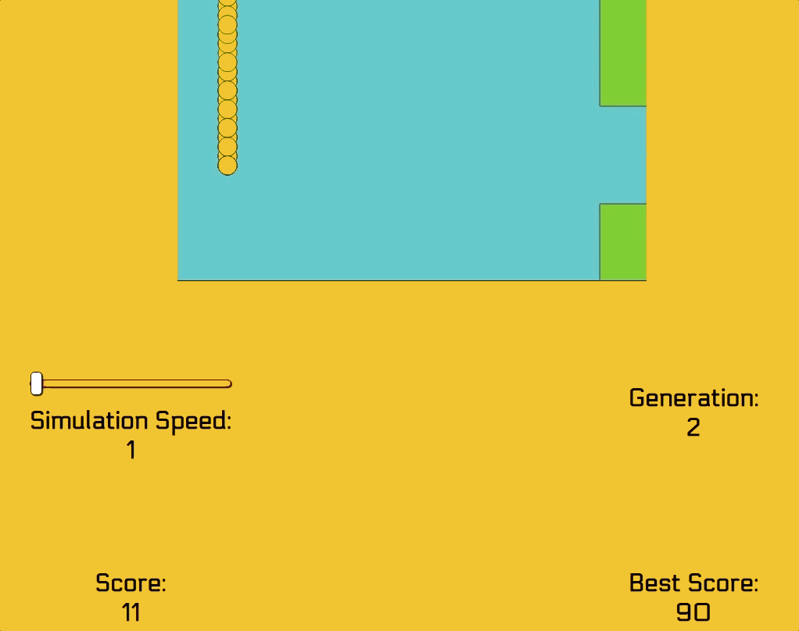

## Flappy Evo
Simulating playing Flappy Bird with AI learning via the genetic algorithm

## Technologies
* JavaScript
* HTML/CSS

## Overview
Flappy Bird is a simple game, but that doesn't mean it's easy to obtain a high score. This simulator teaches AI how to play Flappy Bird (and well). A neural network + genetic algorithm was used to create this simulator. The broad overview of how this is done: the neural network takes in multiple inputs. In this case, 3 inputs: the bird's Y-position, the bird's distance from the next set of pipes, and how fast the bird is going. Whether the bird jumps or not is the single output. The neural network acts like a brain and decides when to jump based on its environment and gets better through trial-and-error. The real MVP of this simulator, though, is the genetic algorithm. The genetic algorithm functions like selectivity in Darwinism. Only the strongest survive. Using the algorithm, many birds (each having a brain, which is the neural network) form one generation. All the birds start the game simultaneously and a new generation is born each time one generation completely dies out, or lose the game rather. Every subsequent generation is smarter than the previous generation. The best/longest-surviving bird is used to breed/create the next generation and some genetic mutation (change the neural net biases technically) happens to ensure that future generations continue to learn (rather than be complacent and assume that they're a perfect AI).
